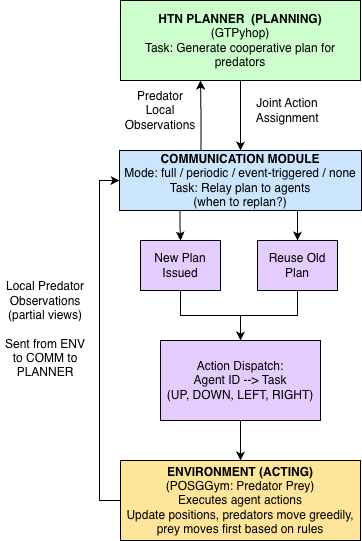

# predator-prey-htn

## Overview

This project explores the role of **communication frequency** in multi-agent coordination under partial observability. We implement a **Hierarchical Task Network (HTN)**-driven predator–prey simulation in which a centralized planner coordinates two predator agents to capture a moving prey. Agents receive discrete action plans from the planner via a configurable communication module that supports **full**, **periodic**, **event-triggered**, or **no communication** modes.

The core research question:

> **How much communication is actually necessary for effective multi-agent coordination in partially observable environments?**

## Key Features

- Joint HTN planning via [GTPyhop](https://github.com/dananau/GTPyhop)
- Centralized planner builds multi-agent joint plans from local observations
- Modular communication controller with four regimes:
  - `full`: replan every step
  - `periodic`: replan every _k_ steps
  - `event`: replan only when prey is visible
  - `none`: use one-time plan with no further updates
- Quantitative evaluation: capture rate, steps to capture, message count, replanning frequency
- Scriptable experiments with automated plotting for publication-ready figures

## Environment

- Based on the `PredatorPrey-v0` environment from [POSGGym](https://posggym.readthedocs.io/)
- 10×10 discrete gridworld with 2 predators and 1 prey
- Prey moves greedily to escape; predators have limited local observations
- Capture requires **both predators to be adjacent** to the prey
- Episodes terminate upon successful capture or after 200 steps

## System Architecture



- **Environment** handles state transitions, movement, and termination
- **Agents** act using the most recent plan or fallback heuristics
- **Centralized HTN planner** constructs symbolic multi-agent plans
- **Communication module** governs how and when plans are transmitted

## Directory Structure

src/
├── comm_module.py # Communication logic (full, periodic, event, none)
├── constants.py # Action IDs and environment codes
├── observers.py # Minimal observer for logging and reporting
├── plan_utils.py # Build GTPyhop-compatible state + decode plans
├── plot_utils.py # Plot capture stats, messages, and trajectories
├── pp_behavior.py # Action policies for chase, patrol, and support
├── pp_htn.py # HTN domain: methods and primitive actions
├── run_demo.py # Main entry point for running experiments
├── sweep_utils.py # Experiment sweeps (e.g., periodic comm vs k)
├── wrappers.py # POSGGym wrappers for action logging


## Running the Simulation

You can run `run_demo.py` with the following options:

```bash
usage: run_demo.py [OPTIONS]

Options:
  --debug                  Enable verbose debug logging
  --keep-prev-action       Allow repeating previous patrol action
  --no-keep-prev-action    Prevent repeating previous action
  --time-horizon INT       Max steps per episode (default: 200)
  --num-episodes INT       Number of episodes to run (default: 1)
  --render-last            Render the final episode visually
  --seed INT               Base seed for reproducibility (optional)
  --rerun-seed INT         Rerun single episode with fixed seed
  --comm-mode STR          Communication mode: [full | periodic | event | none]
  --k-sync INT             Interval for periodic communication (default: 5)
```

### Example: Run a single episode with full communication

```bash
cd src 
python run_demo.py --comm-mode full --num-episodes 1 --render-last
```


### Example: Run 20 episodes with periodic updates every 10 steps
```bash
cd src
python run_demo.py --comm-mode periodic --k-sync 10 --num-episodes 20
```

## Requirements - Python 3.10+ - posggym - gtpyhop - matplotlib - numpy ### Installation We recommend using a virtual environment:
```bash
python3 -m venv venv
source venv/bin/activate
pip install -r requirements.txt
```